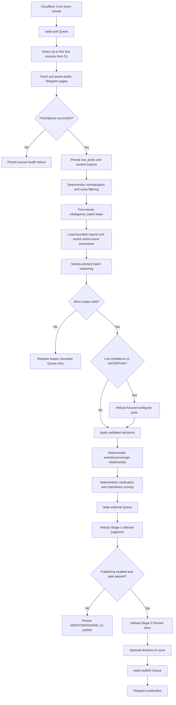

# Radar V8 Processing Flow

Radar is a Cloudflare-only polling pipeline. It does not use Telethon, a Telegram user session, a VPS, embeddings, vector search, or Vectorize.

## End-to-end flow



## Collection and raw persistence

The scheduled handler enqueues one `poll_cycle`. Its consumer selects at most five due sources, polls public pages, and sends failed envelopes to `radar-raw-ingest`. Every raw report is persisted in D1 before intelligence processing. `(source_id, telegram_message_id)` is the ingestion idempotency key; content hashes detect edits.

## Five-minute intelligence batches

Normal polling remains every minute, but event intelligence is accumulated into durable five-minute windows. `intelligence_batches` stores the window, sequence, status, lease, attempts, model, provider, token counts, and error. `intelligence_batch_items` stores the claimed report IDs and the validated applied decision. A small Queue payload carries only the batch ID; D1 remains the source of truth.

Each request is bounded by report count, report text length, active-event count, and total serialized prompt size. Candidate active events are limited to a recent temporal window. Historical backlog recovery is bounded and fresh pending reports are selected first.

## Nebula decision contract

Nebula receives compact reports such as:

```json
{
  "post_id": 8101,
  "source_id": 4,
  "source_name": "IRNA",
  "published_at": "2026-08-14T00:01:00.000Z",
  "text": "..."
}
```

It returns one strict JSON object covering every supplied report exactly once. Supported actions are:

```text
MATCH_EXISTING_EVENT
NEW_EVENT
DUPLICATE
UPDATE_EXISTING_EVENT
NOISE
UNCERTAIN
```

The model may group several reports into one `NEW_EVENT`, but it cannot invent IDs or confirmation counts. Radar validates all identifiers and categories before any D1 mutation. One focused second pass is allowed for ambiguity. Persistent uncertainty remains separate/monitorable.

## Deterministic verification and scoring

Radar creates or updates events, attaches each raw post through the conflict-safe `event_sources(event_id, raw_post_id)` key, preserves copied-source relationships, and calculates origin groups and independent confirmations. The LLM's grouping is semantic input, not verification authority. Event version advancement uses `event_version_applied`, so retries do not increment versions twice. Importance weights and publication rules remain unchanged.

## Editorial and publishing

Events above the existing Stage-1 threshold enter `radar-editorial`. Stage-1 judgment and eventual Stage-2 Persian story generation use Nebula with separate prompts. Covers remain a separate Workers AI image concern. Batch intelligence cannot publish directly. During V8 review:

```text
PUBLISH_ENABLED=false
D1 publishing_enabled=false
```

Stage-2, covers, and Telegram sends therefore remain inactive in production.

## Recovery

Nebula failures release report leases and leave reports pending for bounded Queue retries. Stale batch/report leases are recovered without deleting raw evidence. Migration `0008_remove_embedding_pipeline.sql` drops the obsolete checkpoint table and requeues unfinished legacy analysis states. It preserves historical raw posts, events, source evidence, generic analysis hashes, and lease columns.

## Operations

Useful V8 counters include:

```text
intelligence_batches
intelligence_reports_processed
intelligence_ai_calls
intelligence_ai_failures
intelligence_uncertain
intelligence_second_pass_calls
intelligence_new_events
intelligence_existing_matches
intelligence_duplicates
```

`ai_usage` retains historical rows for audit but creates no new embedding stage. Nebula request telemetry records bounded request count, provider/model when exposed, prompt tokens, completion tokens, and failure state without storing API keys or giant prompts.
