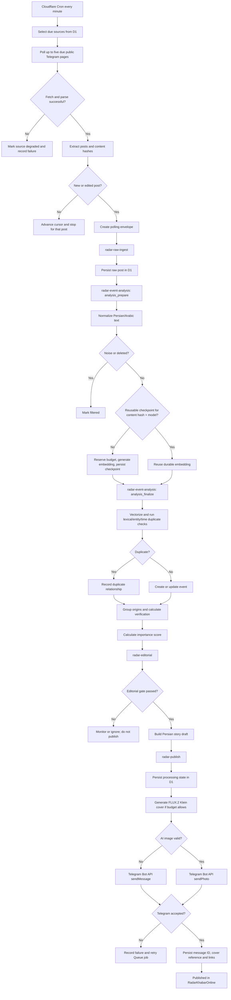

# Radar Processing Flow

This document describes the current production flow of Radar from public Telegram collection to live publication in `RadarKhabarOnline`.

Radar is a Cloudflare-only polling pipeline. It does not use Telethon, a Telegram user session, a VPS, or R2.

## End-to-end flow



## 1. Scheduled collection

The Worker runs on the `* * * * *` Cron trigger.

On each invocation it:

1. Seeds the source registry if the database is empty.
2. Recovers stale publishing jobs older than ten minutes.
3. Selects due sources from D1.
4. Polls at most five due sources per run.
5. Sends every new or edited envelope to `radar-raw-ingest`.

The polling calibration runs every minute with a five-source batch and a 300-second source interval. With 23 active sources, it targets approximately a five-minute revisit interval while staying within the Worker per-invocation limit.

The poller requests:

```text
https://t.me/s/{channel_username}
```

It does not use Telegram MTProto or a user account.

## 2. Public Telegram parsing

For each public page, Radar extracts:

- Telegram message ID;
- canonical message URL;
- published and edited timestamps when available;
- text and captions;
- media hints;
- bounded raw HTML;
- normalized content hash.

The idempotency key is:

```text
(source_id, telegram_message_id)
```

If the same message has the same content hash, it is ignored. If the hash changes, Radar emits an edit envelope. A failed fetch or parser failure is never treated as an empty source; the source is marked degraded and the error is stored in D1.

## 3. Raw ingestion

The `radar-raw-ingest` consumer validates the envelope, confirms that the source exists, and persists the original post in D1. Original text and raw evidence are retained before any normalization.

After persistence, it sends one `analysis_prepare` job to `radar-event-analysis`. The prepare stage owns normalization and embedding only. It writes a D1 checkpoint containing the normalized-text hash, embedding model, and reusable vector before sending `analysis_finalize`.

## 4. Intelligence and event formation

The analysis consumer performs two bounded stages. Each job handles one raw post.

### Stage A: prepare and embed

1. Normalize Persian/Arabic text and classify noise or deleted posts.
2. Calculate a stable hash of the normalized text.
3. Reuse a matching D1 embedding checkpoint when one exists.
4. Otherwise reserve the global AI budget, generate one embedding, and persist the checkpoint immediately.
5. Queue the finalization stage.

### Stage B: analysis finalization

1. Reuse the checkpoint for Vectorize upsert and similarity retrieval using the `radar-events` index.
2. Lexical, entity, and temporal duplicate detection.
3. Duplicate relationship persistence without deleting the original evidence.
4. Event creation or assignment.
5. Event-source attachment and origin-group classification.
6. Verification recalculation.
7. Importance-score recalculation.
8. Mark the raw post `analyzed` and remove the temporary checkpoint.

Event-source insertion is conflict-safe. A small durable version marker ensures one raw post cannot increment an event version repeatedly when finalization retries. Stale analysis leases older than ten minutes are recovered one row at a time by the poll consumer.

D1 remains the source of truth. Vectorize is only a searchable index and is not authoritative event storage.

Repeated, translated, forwarded, or copied reports are grouped so that they do not count as independent confirmation merely because they appear in multiple channels.

Verification states are:

- `CONFIRMED`: credible independent origin groups support the core fact;
- `DEVELOPING`: credible evidence exists but confirmation is incomplete;
- `DISPUTED`: credible sources materially conflict;
- `UNVERIFIED`: evidence is isolated or weak.

## 5. Editorial selection

Events with a score below the analysis threshold stop in the intelligence stage. Higher-scoring candidates enter `radar-editorial`.

The editorial consumer:

1. Loads the current event from D1.
2. Checks source priority and high-priority support.
3. Recalculates the deterministic score.
4. Applies verification and publication gates.
5. Persists the editorial decision.
6. Builds a story draft only for publishable candidates.
7. Sends an approved story to `radar-publish` when live publishing is enabled.

The score weights are:

| Signal | Weight |
|---|---:|
| Impact | 25% |
| Iran relevance | 25% |
| Urgency | 15% |
| Confidence | 15% |
| Novelty | 10% |
| Geopolitical/systemic significance | 10% |

The initial publication gates are:

- `CONFIRMED` with score `>= 78`;
- `DEVELOPING` only with score `>= 90` and high-priority source support;
- `UNVERIFIED` is never automatically published;
- `DISPUTED` requires an explicit dispute presentation and a high score.

The daily story budget is normally fifteen and can increase to twenty-five during high-volume periods.

## 6. Persian story generation

The story builder loads the event, evidence, source links, entities, verification status, and editorial reasons from D1.

It requests structured output from:

```text
@cf/meta/llama-3.2-3b-instruct
```

The output is validated against the story schema. If the model is unavailable, exceeds its budget, returns invalid JSON, or violates the schema, Radar creates a deterministic story from the event data.

The final draft contains:

- Persian title;
- description limited to 1,000 characters;
- verification status;
- independent confirmation count;
- primary sources;
- category;
- entity tags;
- original-source links for Telegram buttons;
- a cover concept.

## 7. Cover generation

The publisher creates the cover immediately before sending the Telegram post.

The configured image model is:

```text
@cf/black-forest-labs/flux-2-klein-4b
```

The Worker sends the prompt as multipart form data with a `640x360` output size and detects the MIME type of the model's Base64 image response before sending it to Telegram.

If the cover call is denied by the daily budget or the response is invalid, Radar publishes the story without a cover. If Telegram rejects a valid image, Radar sends the same story as a text-only message. No replacement or default graphic is generated.

Cover references make the result visible in D1:

```text
ai-generated:events/{event_id}/v{event_version}
```

Queue retries can re-enter the publishing function. The `publish_key` prevents a story version that was already persisted as `published` from being sent again during normal retries. An event-level publication lock also allows only one live Telegram story per event. New evidence that only increments the event version is retained in D1 and marked as an internal/suppressed update instead of creating another channel post.

## 8. Telegram publication

When an AI cover is available, the publisher calls the Bot API `sendPhoto` with:

- destination chat ID `-1004496469105`;
- the PNG cover;
- HTML-formatted Persian caption;
- verification status and confirmation count;
- inline buttons linking to original source posts.

When no cover is available, the publisher calls `sendMessage` with the same Persian HTML story and source buttons.

After Telegram returns a message ID, Radar persists:

- publication state;
- event ID and version;
- Telegram message ID;
- final story fields;
- cover reference and MIME type, or null for a text-only publication;
- source links;
- publication timestamps.

The state transition is:

```text
queued -> processing -> published
                    -> failed -> retry/recovery
```

If Telegram accepts the message but the Worker crashes before D1 persistence, a duplicate send remains theoretically possible. This is the residual ambiguity of Bot API publication without an external idempotency key.

## 9. Queue failures and recovery

For any queue error, Radar:

1. Logs a structured failure event.
2. Increments the D1 queue-failure counter.
3. Records publish-specific errors in `published_stories`.
4. Requests Queue retry.

The scheduled handler also scans for stale publishing records and requeues them after ten minutes. Persistent failures remain visible through the dashboard and operations summary.

## 10. Dashboard and operations visibility

The protected `/admin` dashboard reads a D1-backed snapshot and refreshes approximately every sixty seconds.

It exposes the current state of:

- source health and active-source count;
- observed and persisted posts;
- events and verification distribution;
- editorial decisions;
- published stories;
- queue failures and retries;
- AI calls and estimated neurons;
- cover failures;
- Telegram publishing failures;
- recent raw intake and event activity.

The public health endpoint is:

```text
GET /health
```

The authenticated operations endpoint is:

```text
GET /ops/summary
```

## Important architecture limits

- Collection is scheduled polling, not real-time Telegram delivery.
- Public Telegram pages do not reliably expose numeric channel IDs.
- Delete events are not reliably observable.
- Forward and edit metadata is incomplete.
- Covers are held in memory and sent directly to Telegram; R2 is not used.
- AI stages fail closed. Raw evidence and events are preserved when AI is unavailable.
- A cover is optional. Failed generation must not block publication, and no fallback graphic is sent.
